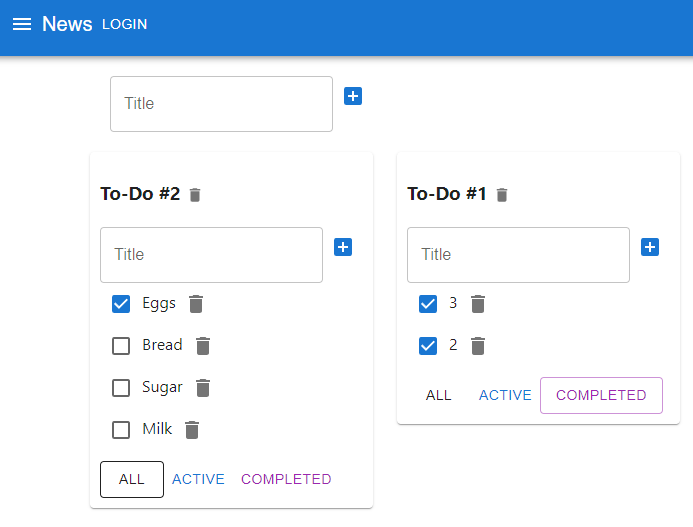
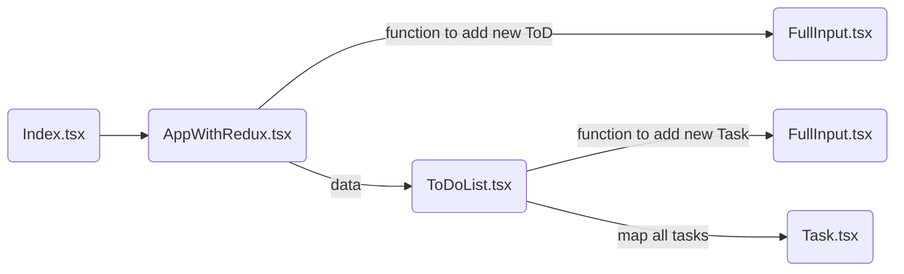

## Pet project "To-do list"
### by Anton Rybakou

### Using:
1. [TypeScript](https://www.typescriptlang.org/)
2. [React](https://reactjs.org/)
3. [Redux](https://redux.js.org/)
4. [MUI](https://material-ui.com/)
5. [Storybook](https://storybook.js.org/)

### Structure:
