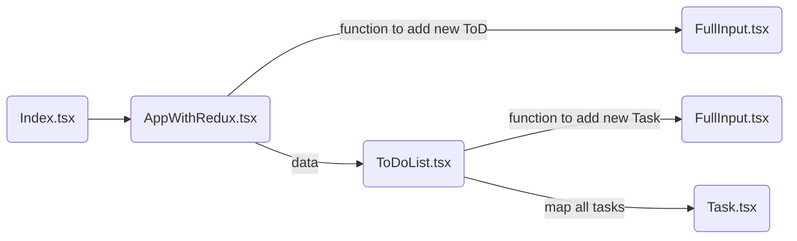

## Pet project "To-do list"
### by Anton Rybakou

### Using:
1. TypeScript
2. React
3. Redux
4. @mui
5. storybook

### Structure:

```mermaid
  graph LR;
    I(Index.tsx)-->A(AppWithRedux.tsx);
    A--function to add new ToDo-->C1(FullInput.tsx);
    A--data-->T(ToDoList.tsx);
    
    T--function to add new Task-->C2(FullInput.tsx);
    T--map all tasks-->C3(Task.tsx);
```